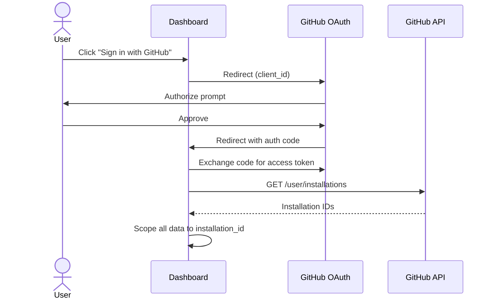
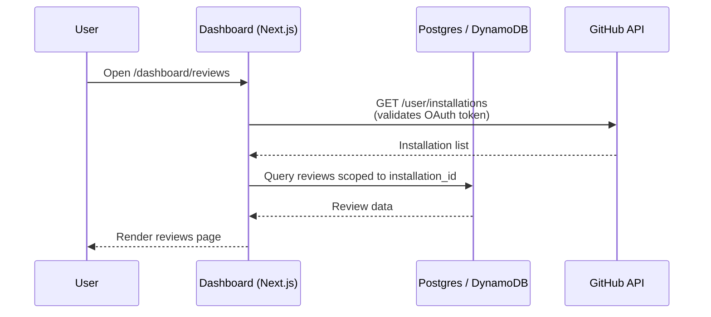

The MergeWatch dashboard is a Next.js application that provides a web UI for managing reviews, repositories, and settings. It authenticates users with GitHub OAuth and connects to the MergeWatch backend API.

<Frame caption="The MergeWatch landing page at mergewatch.ai.">
  
</Frame>

## Deployment

<Tabs>
  <Tab title="Self-Hosted (Docker Compose)">
    In self-hosted mode, the dashboard ships as a second service in your `docker-compose.yml` alongside the MergeWatch server and Postgres.

    ### Docker Compose configuration

    The dashboard service is already included in the default `docker-compose.yml`. Here is the relevant section:

    ```yaml docker-compose.yml
    dashboard:
      image: ghcr.io/santthosh/mergewatch-dashboard:0.1.0
      restart: unless-stopped
      environment:
        DEPLOYMENT_MODE: self-hosted
        DATABASE_URL: postgres://postgres:postgres@db:5432/mergewatch
        NEXTAUTH_URL: ${DASHBOARD_URL:-http://localhost:3001}
        NEXTAUTH_SECRET: ${NEXTAUTH_SECRET}
        GITHUB_CLIENT_ID: ${GITHUB_CLIENT_ID}
        GITHUB_CLIENT_SECRET: ${GITHUB_CLIENT_SECRET}
        PORT: "3001"
      ports:
        - "3001:3001"
      depends_on:
        mergewatch:
          condition: service_healthy
    ```

    ### Environment variables

    Add these to your `.env` file:

    | Variable | Required | Description |
    | --- | --- | --- |
    | `GITHUB_CLIENT_ID` | Yes | OAuth client ID from your GitHub App's **OAuth Credentials** section (same App, not a separate OAuth App) |
    | `GITHUB_CLIENT_SECRET` | Yes | OAuth client secret from your GitHub App |
    | `NEXTAUTH_SECRET` | Yes | Random secret for NextAuth session signing. Generate with `openssl rand -base64 32` |
    | `DASHBOARD_URL` | No | Public URL of the dashboard. Docker Compose wires this into `NEXTAUTH_URL`. Defaults to `http://localhost:3001`. |

    <Note>
    The dashboard reads from the MergeWatch Postgres database directly via `DATABASE_URL` — there is no HTTP call from the dashboard to the Express server, so no `NEXT_PUBLIC_API_URL` is required.
    </Note>

    ### Start the dashboard

    The dashboard starts automatically with the rest of the stack:

    ```bash
    docker compose up -d
    ```

    Access the dashboard at [http://localhost:3001](http://localhost:3001).

    ### Upgrade

    ```bash
    docker compose pull dashboard
    docker compose up -d dashboard
    ```
  </Tab>

  <Tab title="SaaS (AWS Amplify)">
    The SaaS dashboard runs on AWS Amplify with Git-native deploys. Push to `main` and Amplify builds and deploys automatically.

    ### Why Amplify

    - **Zero server management** — Amplify handles builds, CDN, and SSL automatically
    - **Git-native deploys** — push to `main`, Amplify builds and deploys
    - **Environment variable management** — secrets stored in Amplify Console, injected at build time
    - **Custom domain** — one-click custom domain with ACM certificate provisioning

    ### Prerequisites

    - Your API Gateway URL from the SaaS stack
    - Your GitHub App credentials (App ID, Client ID, Client Secret)
    - An AWS account with Amplify access

    ### Environment variables

    Configure these in the Amplify Console under **App settings > Environment variables**.

    <Warning>
    Never commit environment variables to your repository. Variables prefixed with `NEXT_PUBLIC_` are embedded in the client bundle and visible to users — do not use this prefix for secrets.
    </Warning>

    #### Required — GitHub OAuth

    | Variable | Description | Where to find it |
    | --- | --- | --- |
    | `GITHUB_CLIENT_ID` | GitHub App's OAuth Client ID | GitHub App settings > OAuth Credentials |
    | `GITHUB_CLIENT_SECRET` | GitHub App's OAuth Client Secret | GitHub App settings > OAuth Credentials |
    | `NEXTAUTH_SECRET` | Random secret for NextAuth session signing | Generate: `openssl rand -base64 32` |
    | `NEXTAUTH_URL` | Full URL of your deployed dashboard | Your Amplify app URL |

    #### Required — SaaS billing wiring

    | Variable | Description | Where to find it |
    | --- | --- | --- |
    | `DEPLOYMENT_MODE` | Set to `saas` to enable the billing UI | Amplify env var |
    | `BILLING_API_URL` | Base URL of the BillingHandler Lambda | SAM stack output: `BillingUrl` |
    | `BILLING_API_SECRET` | Shared secret for dashboard → BillingHandler auth | SSM: `/mergewatch/{stage}/billing-api-secret` |
    | `GITHUB_APP_ID` | GitHub App ID | GitHub App settings |
    | `GITHUB_APP_SLUG` | GitHub App slug (used to build install URLs) | GitHub App settings |

    ### Deployment steps

    <Steps>
      <Step title="Connect your repository to Amplify">
        1. Open the [AWS Amplify Console](https://console.aws.amazon.com/amplify/home)
        2. Click **Create new app > Host web app**
        3. Select **GitHub** as your source provider
        4. Authorize Amplify to access your GitHub account
        5. Select the repository and the `main` branch
        6. Click **Next**
      </Step>

      <Step title="Configure build settings">
        Amplify auto-detects Next.js. Confirm the build spec:

        ```yaml amplify.yml
        version: 1
        frontend:
          phases:
            preBuild:
              commands:
                - npm ci
            build:
              commands:
                - npm run build
          artifacts:
            baseDirectory: .next
            files:
              - '**/*'
          cache:
            paths:
              - node_modules/**/*
        ```
      </Step>

      <Step title="Set environment variables">
        Add all required environment variables under **Advanced settings > Environment variables** during setup, or navigate to **Amplify Console > Your app > App settings > Environment variables**.
      </Step>

      <Step title="Deploy">
        Click **Save and deploy**. First deploy takes approximately 3-5 minutes. Subsequent deploys triggered by `git push` typically take 2-3 minutes.
      </Step>

      <Step title="Set NEXTAUTH_URL">
        Once deployed, copy your Amplify app URL (e.g. `https://main.abc123.amplifyapp.com`) and update the `NEXTAUTH_URL` environment variable. Trigger a redeploy.

        <Tip>
        Add this URL to your GitHub App's **Callback URLs** in GitHub App settings (Settings > Developer settings > GitHub Apps > your app > General > Callback URL).
        </Tip>
      </Step>

      <Step title="(Optional) Set a custom domain">
        In **App settings > Domain management**, add your custom domain. Amplify provisions an ACM certificate automatically. DNS propagation takes 10-30 minutes.
      </Step>
    </Steps>
  </Tab>
</Tabs>

---

## GitHub authentication

<Frame caption="The sign-in page uses GitHub OAuth — no code access is required.">
  
</Frame>

The dashboard uses **NextAuth.js with the GitHub provider**. The same GitHub App that handles webhooks also authenticates users — there is no separate OAuth app.



### GitHub scopes requested

MergeWatch requests the **minimum scopes** needed:

| Scope | Why |
| --- | --- |
| `read:user` | Get authenticated user's profile and username |
| `user:email` | Display user identity in the dashboard header |

The GitHub App installation permissions (not OAuth scopes) handle repository access — the OAuth login is purely for identity, not code access.

### Organization support

- **Org installation** — when a GitHub App is installed on an org, any org member with admin rights can access the dashboard for that installation
- **Access check** — the dashboard calls `GET /orgs/{org}/members/{username}` with `role=admin` to verify the user is an org admin before showing settings controls
- **Multiple installations** — a single user can have multiple installations (personal + multiple orgs). The dashboard shows all installations and lets them switch between them
- **No separate org concept** — GitHub's own org membership model is the source of truth for access control

### Session model

Sessions are stored as **encrypted JWT cookies** (default NextAuth behavior). No session database is needed. The JWT contains:

- GitHub user ID and username
- OAuth access token (for GitHub API calls from the frontend)
- Installation IDs the user has access to

Session expiry defaults to 30 days.

---

## Connecting dashboard to backend

The dashboard's Next.js API routes read from the same data store the webhook pipeline writes to — Postgres in self-hosted mode and DynamoDB in SaaS mode. There is **no HTTP call** from the dashboard to the Express/Lambda webhook server, so no public API URL environment variable is required.



Access control lives in each `/api/*` route: it validates the NextAuth session, calls the GitHub API with the user's OAuth token to confirm installation access, then reads/writes the store.

---

## Troubleshooting

<AccordionGroup>

<Accordion title="Build fails with 'Module not found'">
Run `npm ci` locally and confirm the build passes before pushing. Check that `package-lock.json` is committed.
</Accordion>

<Accordion title="Sign-in fails with 'Configuration' error">
The `NEXTAUTH_SECRET` or `NEXTAUTH_URL` environment variables are missing or incorrect. Confirm `NEXTAUTH_URL` exactly matches your dashboard URL (no trailing slash).
</Accordion>

<Accordion title="Blank dashboard after sign-in">
The dashboard cannot reach its data store. For self-hosted, verify `DATABASE_URL` resolves inside the container (the `db` service must be healthy — `docker compose ps` should show it as `healthy`). For SaaS, confirm the dashboard's IAM role can read the MergeWatch DynamoDB tables.
</Accordion>

<Accordion title="GitHub returns 'redirect_uri_mismatch'">
Add your dashboard URL to your GitHub App's **Callback URLs** in GitHub App settings (Settings > Developer settings > GitHub Apps > your app > General > Callback URL).
</Accordion>

<Accordion title="User sees wrong installation data">
Confirm the `GITHUB_APP_ID` matches your deployed GitHub App. Mismatches cause installation lookups to return empty results.
</Accordion>

</AccordionGroup>

---

<CardGroup cols={2}>

<Card title="Dashboard Overview" icon="gauge" href="/dashboard/overview">
  Learn about the dashboard pages and access control model.
</Card>

<Card title="Self-Hosting Install" icon="terminal" href="/self-hosting/install">
  Deploy the full stack with Docker Compose.
</Card>

</CardGroup>
