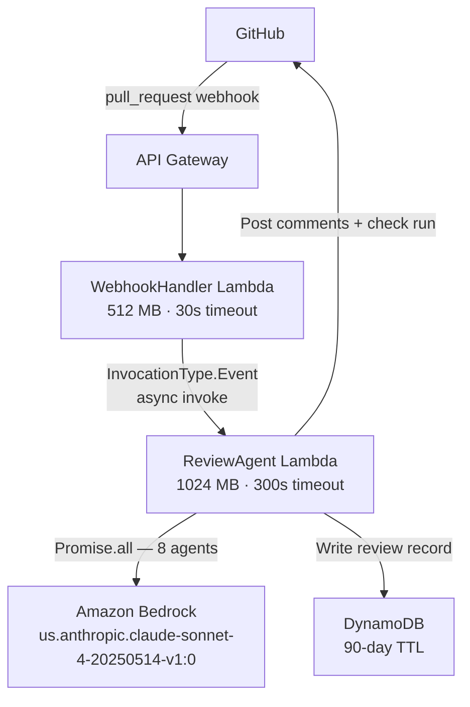
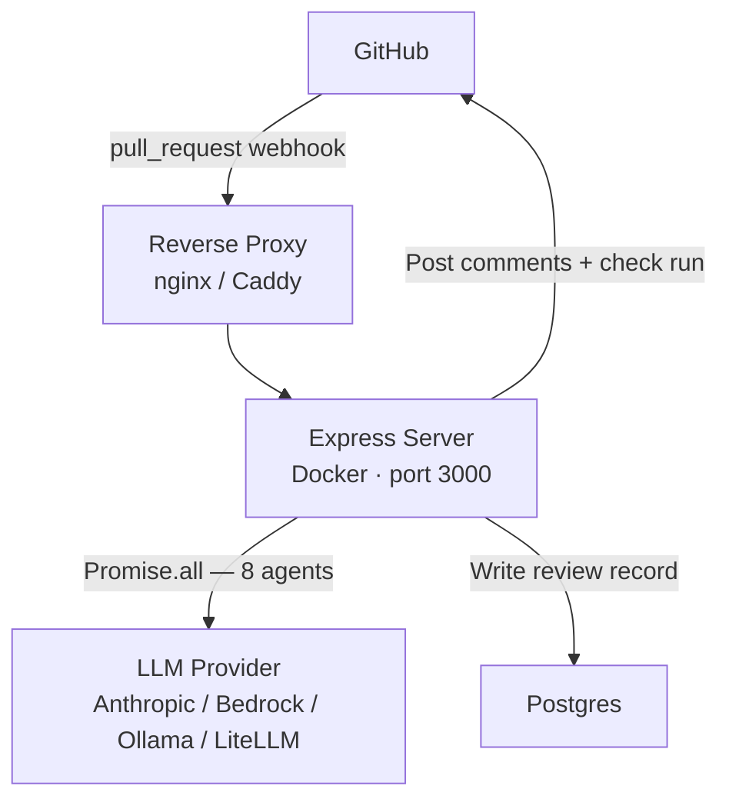

MergeWatch can run as a fully managed SaaS service or as a self-hosted Docker deployment. Both architectures follow the same review pipeline — the difference is where the components run and which LLM provider handles inference.

## SaaS architecture

The managed SaaS deployment runs entirely on AWS in MergeWatch's account.

### SaaS component table

| Component | Type | Spec | Role |
|---|---|---|---|
| API Gateway | REST API | 29s integration timeout | Receive GitHub webhook, proxy to Lambda |
| WebhookHandler | Lambda (Node 20, ARM64) | 512 MB, 30s timeout | Validate HMAC, parse event, invoke ReviewAgent async |
| ReviewAgent | Lambda (Node 20, ARM64) | 1024 MB, 300s timeout | Fetch diff, fan out to 8 agents, post results |
| DynamoDB | On-demand tables | 90-day TTL on reviews | Installation config, review history |
| SSM Parameter Store | SecureString | KMS-encrypted | GitHub App credentials |
| Bedrock | Model inference | `us.anthropic.claude-sonnet-4-20250514-v1:0` | Powers all 8 review agents |

### SaaS latency breakdown

| Step | Duration |
|---|---|
| GitHub to API Gateway | <100 ms |
| WebhookHandler Lambda | 200–500 ms |
| ReviewAgent startup (cold) | 5–10 s |
| GitHub diff fetch | 200–800 ms |
| 8x parallel Bedrock calls | 8–20 s |
| Orchestrator (dedup + ranking) | 3–8 s |
| GitHub comment posting | 200–500 ms |
| **Total (warm)** | **~15–35 s** |
| **Total (cold start)** | **~25–50 s** |

<Tip>
Cold starts only affect the first invocation after a period of inactivity. Once the Lambda is warm, subsequent reviews skip the 5–10s startup penalty. Under steady load, most reviews complete in under 30 seconds.
</Tip>

---

## Self-hosted architecture

The self-hosted deployment runs as a Docker container on your own infrastructure.

### Self-hosted component table

| Component | Type | Spec | Role |
|---|---|---|---|
| Reverse proxy | nginx / Caddy | Your domain, TLS termination | Route webhook traffic to Express server |
| Express server | Docker container | Port 3000 | Validate HMAC, fetch diff, run 8 agents, post results |
| Postgres | Database | Persistent storage | Installation config, review history |
| LLM provider | Any supported provider | Anthropic, Bedrock, Ollama, LiteLLM | Powers all 8 review agents |
| Dashboard | Next.js (docker-compose) | Second service in compose file | View reviews, manage repos, configure settings |

### Self-hosted latency breakdown

| Step | Duration |
|---|---|
| GitHub to reverse proxy | <100 ms |
| Express server processing | 100–300 ms |
| GitHub diff fetch | 200–800 ms |
| 8x parallel LLM calls | 5–30 s (varies by provider) |
| Orchestrator (dedup + ranking) | 2–6 s |
| GitHub comment posting | 200–500 ms |
| **Total (typical)** | **~10–40 s** |

<Note>
Self-hosted latency depends heavily on your LLM provider. Local models via Ollama are fastest for small diffs. Cloud providers like Anthropic or Bedrock add network round-trip time but handle large diffs more reliably.
</Note>

---

## Concurrency model

Both architectures run the eight review agents — **security**, **bugs**, **style**, **error handling**, **test coverage**, **comment accuracy**, **summary**, and **diagram** — in parallel via `Promise.all()`.

- **SaaS**: WebhookHandler invokes ReviewAgent asynchronously via the AWS Lambda Invoke API (`InvocationType.Event`). There is no queue between the two functions and no per-PR serialization. Two rapid pushes to the same PR each trigger a separate ReviewAgent invocation that runs concurrently.
- **Self-hosted**: The Express server handles each webhook request in a single async function. Concurrent PRs are handled by Node.js's event loop. For high-volume organizations, scale horizontally by running multiple container replicas behind a load balancer.

In both modes, if two invocations overlap on the same PR, the last one to finish overwrites the summary comment (last write wins). Inline review comments are additive and not affected by concurrency.

## Next steps

<CardGroup cols={2}>
  <Card title="Deployment Models" icon="cloud" href="/deployment/deployment-models">
    Compare self-hosted and managed SaaS side by side.
  </Card>
  <Card title="SAM Template Reference" icon="file-code" href="/deployment/sam-template">
    Explore the SAM template parameters, resources, and outputs (SaaS only).
  </Card>
  <Card title="Self-Hosting Install" icon="server" href="/self-hosting/install">
    Deploy MergeWatch on your own infrastructure with Docker.
  </Card>
  <Card title="SaaS Getting Started" icon="rocket" href="/saas/getting-started">
    Install the GitHub App and start reviewing PRs in minutes.
  </Card>
</CardGroup>
