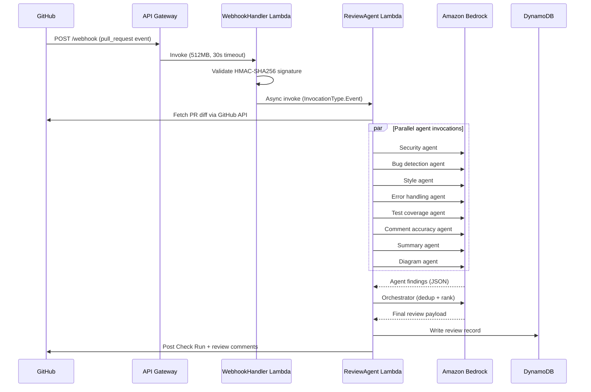
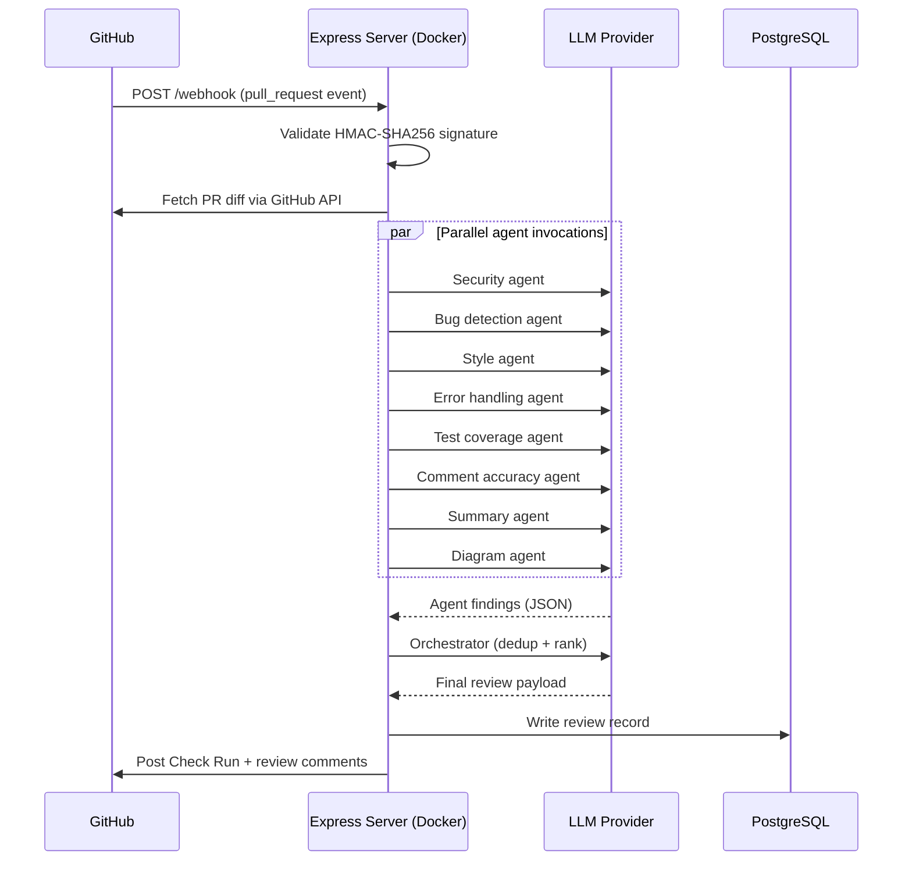
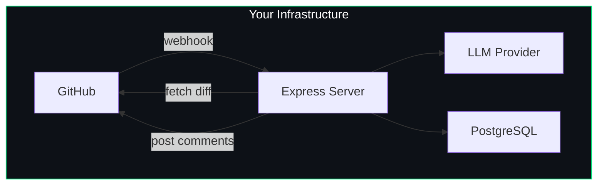
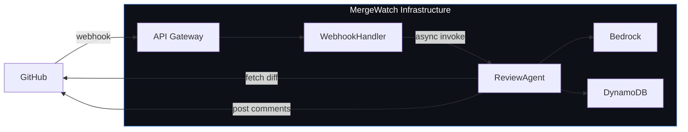

## Architecture overview

When a pull request is opened (or updated), GitHub sends a webhook to MergeWatch. The event flows through a review pipeline that ends with review comments posted back to the PR.

MergeWatch supports two deployment modes with different architectures. The review pipeline and agent behavior are identical in both.

### SaaS architecture

<Note>
This diagram shows the managed SaaS architecture running in MergeWatch's AWS account.
</Note>



### Self-Hosted architecture

<Note>
This diagram shows the self-hosted architecture running on your infrastructure with Docker.
</Note>



## Step-by-step flow

<Steps>
  <Step title="PR opened or updated">
    A developer opens a pull request or pushes new commits. GitHub fires a `pull_request` webhook event (`opened`, `synchronize`, or `reopened`).
  </Step>
  <Step title="Webhook received">
    **SaaS:** API Gateway receives the POST request and invokes the WebhookHandler Lambda (512 MB, 30 s timeout).

    **Self-Hosted:** The Express server receives the POST request on the `/webhook` endpoint (port 3000).

    In both modes, the handler validates the payload against the webhook secret using HMAC-SHA256. Invalid signatures are rejected with a 401.
  </Step>
  <Step title="Review pipeline starts">
    **SaaS:** The handler invokes the ReviewAgent Lambda asynchronously using `InvocationType.Event` (fire-and-forget). The ReviewAgent Lambda (1024 MB, 300 s timeout) picks up the event.

    **Self-Hosted:** The Express server processes the review in the same process, running the agent pipeline asynchronously after acknowledging the webhook.

    In both modes, the PR diff is fetched from the GitHub API using the installation token, then fanned out to eight specialized agents.
  </Step>
  <Step title="Multi-agent parallel review">
    Eight agents run concurrently via `Promise.all()` — see [the pipeline](#the-multi-agent-pipeline) below. Each agent receives the diff and returns structured JSON findings.
  </Step>
  <Step title="Orchestration">
    The orchestrator agent receives all findings, deduplicates overlapping comments, ranks by severity and confidence, and produces a merge readiness score (1--5).
  </Step>
  <Step title="Results posted to GitHub">
    MergeWatch posts a **Check Run** with a status and conclusion, plus inline review comments on the relevant lines.

    - MergeWatch adds a :eyes: reaction to the PR when starting a review to signal that analysis is underway.
    - On re-review, MergeWatch dismisses stale reviews before posting new ones.
    - The summary comment is edited in place (not duplicated) on re-review.

    **SaaS:** The review record is written to DynamoDB.

    **Self-Hosted:** The review record is written to PostgreSQL.
  </Step>
</Steps>

## The multi-agent pipeline

Eight specialized agents run in parallel. Each is a separate LLM invocation with a focused system prompt.

| Agent | Responsibility | Example finding |
|---|---|---|
| **Security** | SQL injection, XSS, secrets in code, dependency vulnerabilities | "User input passed to `exec()` without sanitization" |
| **Bug detection** | Null derefs, off-by-ones, race conditions, logic errors | "Array index `i + 1` can exceed `arr.length`" |
| **Style** | Naming conventions, dead code, missing types, readability | "Exported function `processData` has no JSDoc" |
| **Error handling** | Empty catch blocks, swallowed errors, unhandled promise rejections | "Promise rejection in `fetchUser()` is caught but silently ignored" |
| **Test coverage** | Missing tests for new public functions, untested edge cases | "New exported function `validateInput()` has no corresponding test" |
| **Comment accuracy** | Misleading or outdated code comments, incorrect JSDoc | "JSDoc says `@returns string` but function returns `Promise<string>`" |
| **Summary** | Human-readable summary of the PR's intent and scope | "Adds rate limiting to the `/api/upload` endpoint" |
| **Diagram** | Generates a Mermaid diagram of the changed control flow | Mermaid sequence or flowchart of the new code path |

All eight agents run via `Promise.all()` — the total latency is bounded by the slowest agent, not the sum.

### Agent output schema

Every agent (except summary and diagram) returns an array of findings in this shape:

```json
{
  "file": "src/api/handler.ts",
  "line": 42,
  "severity": "critical",
  "confidence": 92,
  "title": "Unsanitized input passed to shell exec",
  "description": "The `command` variable includes user-supplied input from `req.body.cmd` and is passed directly to `child_process.exec()`. This allows arbitrary command injection.",
  "suggestion": "Use `execFile()` with an explicit argument array, or validate `cmd` against an allowlist."
}
```

| Field | Type | Description |
|---|---|---|
| `file` | `string` | Relative path to the file in the diff |
| `line` | `number` | Line number in the new version of the file |
| `severity` | `"critical" \| "warning" \| "info"` | How urgent the finding is |
| `confidence` | `number` (1--100) | How confident the agent is that this is a real issue, not a false positive |
| `title` | `string` | One-line summary of the finding |
| `description` | `string` | Detailed explanation |
| `suggestion` | `string` | Recommended fix |

### Orchestrator behavior

After all agents complete, the orchestrator:

1. **Deduplicates** — if the security agent and the bug agent both flag the same line for the same root cause, only the higher-confidence finding is kept.
2. **Ranks** — findings are sorted by severity (critical > warning > info), then by confidence descending.
3. **Scores** — a merge readiness score from 1 to 5 is computed:

| Score | Criteria | Meaning |
|---|---|---|
| 5 | No critical findings, at most 1 warning | No issues found. Ship it. |
| 4 | No critical findings, 2-3 warnings | Minor suggestions only. |
| 3 | No critical findings but 4+ warnings, OR exactly 1 critical finding | Warnings present. Review recommended before merge. |
| 2 | 2 or more critical findings | Critical findings present. Do not merge without addressing. |
| 1 | 3+ critical findings or a major security vulnerability | High-confidence critical findings. Merge blocked. |

## Re-review delta caption

When a PR is re-reviewed (a new commit on a PR MergeWatch has already reviewed), a separate **delta-caption** pass runs after the orchestrator. It compares the new findings against the prior review and produces a single sentence describing what shifted on this commit — *"Resolved two security findings; introduced a new error-handling warning"*. The caption is rendered between the delta strip and the merge-readiness verdict in the review comment.

The delta-caption agent runs only on re-reviews and only when at least one finding was resolved or newly introduced. If both lists are empty (carried-over findings only) the agent returns nothing and no caption is rendered.

## Agent-authored PRs

MergeWatch detects pull requests authored by coding agents (Claude Code, Cursor, Codex, etc.) using commit trailers, branch prefixes, and labels. When a PR is detected as agent-authored:

- A stricter prompt suffix is injected into every finding-producing agent. It tells the model to be extra suspicious of hallucinated APIs, no-op tests, dead branches, and references to deprecated patterns.
- Iteration count is tracked across re-reviews, and a "reviewer whisper" line is added to the comment when the agent has taken multiple rounds to converge.
- The configured `passThreshold` (default `noCritical`) gates whether the PR is considered passing.

See the [`agentReview` config block](/configuration/mergewatch-yml#agent-authored-prs) for detection rules and overrides.

## Codebase awareness

MergeWatch supports **agentic file fetching** for cross-file context. When enabled, agents can request additional files from the repository via the GitHub API to understand surrounding context — such as imported modules, type definitions, or test files — beyond what the PR diff includes.

Codebase awareness is controlled by three configuration options in `.mergewatch.yml`:

| Property | Type | Default | Description |
|---|---|---|---|
| `codebaseAwareness` | `boolean` | `true` | Enable agentic file fetching. When `true`, agents can request additional files for cross-file context. |
| `maxFileRequestRounds` | `number` | `1` | Maximum rounds of file fetching per agent. Each round lets the agent request more files based on what it learned in the previous round. Maximum value is `2`. |
| `maxContextKB` | `number` | `256` | Maximum total size (in KB) of fetched files per agent. Prevents runaway context expansion on large repositories. |

<Tip>
Codebase awareness is enabled by default. To revert to diff-only analysis (faster, lower cost), set `codebaseAwareness: false` in your `.mergewatch.yml`.
</Tip>

**Future plans:** A planned enhancement will add an embedding index of the full repository, enabling agents to understand cross-file dependencies and architectural patterns without explicit file fetching.

## Infrastructure details

### Self-Hosted

<CardGroup cols={2}>
  <Card title="Express Server (Docker)">
    - **Image:** `ghcr.io/santthosh/mergewatch:latest`
    - **Port:** 3000
    - **Webhook endpoint:** `/webhook`
    - **Role:** Validate signature, fetch diff, invoke agents, run orchestrator, post results
  </Card>
  <Card title="PostgreSQL">
    - **Storage:** Review history, installation config, repo settings
    - **ORM:** Drizzle ORM (`packages/storage-postgres`)
    - **Managed by:** Docker Compose sidecar
  </Card>
</CardGroup>

### SaaS

<CardGroup cols={2}>
  <Card title="WebhookHandler Lambda">
    - **Memory:** 512 MB
    - **Timeout:** 30 seconds
    - **Role:** Validate HMAC-SHA256 signature, parse event, invoke ReviewAgent (async)
  </Card>
  <Card title="ReviewAgent Lambda">
    - **Memory:** 1024 MB
    - **Timeout:** 300 seconds (5 min)
    - **Role:** Fetch diff, invoke agents, run orchestrator, post results
  </Card>
  <Card title="DynamoDB Tables">
    - **`installations`** — GitHub App installation config, repo settings
    - **`reviews`** — Review history, agent findings, scores
    - **Billing mode:** On-demand (pay-per-request)
  </Card>
  <Card title="Amazon Bedrock">
    - **Default model:** `us.anthropic.claude-sonnet-4-20250514-v1:0`
    - **Role:** Powers all eight review agents and the orchestrator
  </Card>
</CardGroup>

## Data flow

Where your data goes depends on which deployment model you choose.

### Self-Hosted



**Everything stays on your infrastructure.** MergeWatch has zero access. You run the Docker container, you own the data, you see every log. MergeWatch (the company) never sees your code, your diffs, your review results, or your LLM usage.

### Managed SaaS



Everything runs in MergeWatch's infrastructure. Your diff is processed by MergeWatch's Lambda and sent to MergeWatch's Bedrock. This is the fastest setup but offers the least data isolation.

<Warning title="What data does MergeWatch see?">
**Self-hosted:** Nothing. MergeWatch has no access to your infrastructure, your code, your diffs, or your review results. Zero telemetry is sent back.

**Managed SaaS:** MergeWatch sees everything: the diff, the LLM prompts and responses, and the review results. This is the trade-off for zero-setup convenience.

If your security posture requires that code never leave your infrastructure, use **self-hosted**.
</Warning>

## Check Runs

MergeWatch uses the GitHub [Check Runs API](https://docs.github.com/en/rest/checks/runs) to report results. Each review creates a Check Run with:

- **`status`**: `queued` → `in_progress` → `completed`
- **`conclusion`**: `success` (score 4--5), `neutral` (score 3), or `failure` (score 1--2)
- **`output.title`**: Merge readiness score and finding count
- **`output.summary`**: The summary agent's output plus the orchestrator's ranked findings

This integrates with GitHub's branch protection rules — you can require the MergeWatch check to pass before merging.

## GitHub review events

MergeWatch maps merge-readiness scores to GitHub review events:

| Merge score | GitHub review event | Effect |
|---|---|---|
| 4-5 | `APPROVE` | PR shows as approved by MergeWatch |
| 3 | `COMMENT` | PR shows review comments without approval |
| 1-2 | `REQUEST_CHANGES` | PR shows changes requested by MergeWatch |

This integrates with GitHub's required reviewers — if MergeWatch is a required reviewer, low scores can block merging.

---

<CardGroup cols={2}>
  <Card title="Quickstart" icon="rocket" href="/overview/quickstart">
    Install MergeWatch and get your first review in under 10 minutes.
  </Card>
  <Card title="Configuration" icon="gear" href="/configuration/mergewatch-yml">
    Customize agent behavior, skip rules, and model selection via `.mergewatch.yml`.
  </Card>
</CardGroup>
