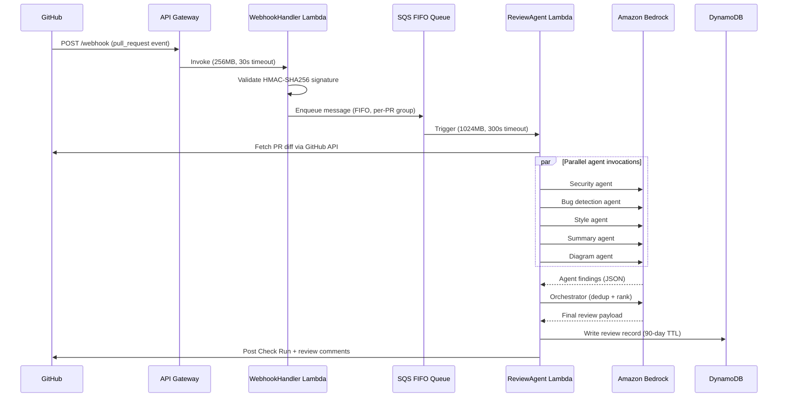

## Architecture overview

When a pull request is opened (or updated), GitHub sends a webhook to MergeWatch. The event flows through a serverless pipeline that ends with review comments posted back to the PR.



## Step-by-step flow

<Steps>
  <Step title="PR opened or updated">
    A developer opens a pull request or pushes new commits. GitHub fires a `pull_request` webhook event (`opened`, `synchronize`, or `reopened`).
  </Step>
  <Step title="Webhook received">
    API Gateway receives the POST request and invokes the **WebhookHandler Lambda** (256 MB, 30 s timeout). The handler validates the payload against the webhook secret using HMAC-SHA256. Invalid signatures are rejected with a 401.
  </Step>
  <Step title="Event queued">
    The handler publishes a message to an **SQS FIFO queue**. The message group ID is `{owner}/{repo}#{pr_number}`, which guarantees sequential processing per PR — if a developer pushes twice in quick succession, reviews are processed in order, not in parallel.
  </Step>
  <Step title="ReviewAgent invoked">
    SQS triggers the **ReviewAgent Lambda** (1024 MB, 300 s timeout). The agent fetches the PR diff from the GitHub API using the installation token, then fans out to five specialized agents.
  </Step>
  <Step title="Multi-agent parallel review">
    Five agents run concurrently via `Promise.all()` — see [the pipeline](#the-multi-agent-pipeline) below. Each agent receives the diff and returns structured JSON findings.
  </Step>
  <Step title="Orchestration">
    The orchestrator agent receives all findings, deduplicates overlapping comments, ranks by severity and confidence, and produces a merge readiness score (1--5).
  </Step>
  <Step title="Results posted to GitHub">
    MergeWatch posts a **Check Run** with a status and conclusion, plus inline review comments on the relevant lines. The review record is written to DynamoDB with a 90-day TTL.
  </Step>
</Steps>

## The multi-agent pipeline

Five specialized agents run in parallel. Each is a separate Bedrock invocation with a focused system prompt.

| Agent | Responsibility | Example finding |
|---|---|---|
| **Security** | SQL injection, XSS, secrets in code, dependency vulnerabilities | "User input passed to `exec()` without sanitization" |
| **Bug detection** | Null derefs, off-by-ones, race conditions, logic errors | "Array index `i + 1` can exceed `arr.length`" |
| **Style** | Naming conventions, dead code, missing types, readability | "Exported function `processData` has no JSDoc" |
| **Summary** | Human-readable summary of the PR's intent and scope | "Adds rate limiting to the `/api/upload` endpoint" |
| **Diagram** | Generates a Mermaid diagram of the changed control flow | Mermaid sequence or flowchart of the new code path |

All five agents run via `Promise.all()` — the total latency is bounded by the slowest agent, not the sum.

### Agent output schema

Every agent (except summary and diagram) returns an array of findings in this shape:

```json
{
  "file": "src/api/handler.ts",
  "line": 42,
  "severity": "critical",
  "confidence": 92,
  "title": "Unsanitized input passed to shell exec",
  "description": "The `command` variable includes user-supplied input from `req.body.cmd` and is passed directly to `child_process.exec()`. This allows arbitrary command injection.",
  "suggestion": "Use `execFile()` with an explicit argument array, or validate `cmd` against an allowlist."
}
```

| Field | Type | Description |
|---|---|---|
| `file` | `string` | Relative path to the file in the diff |
| `line` | `number` | Line number in the new version of the file |
| `severity` | `"critical" \| "warning" \| "info"` | How urgent the finding is |
| `confidence` | `number` (1--100) | How confident the agent is that this is a real issue, not a false positive |
| `title` | `string` | One-line summary of the finding |
| `description` | `string` | Detailed explanation |
| `suggestion` | `string` | Recommended fix |

### Orchestrator behavior

After all agents complete, the orchestrator:

1. **Deduplicates** — if the security agent and the bug agent both flag the same line for the same root cause, only the higher-confidence finding is kept.
2. **Ranks** — findings are sorted by severity (critical > warning > info), then by confidence descending.
3. **Scores** — a merge readiness score from 1 to 5 is computed:

| Score | Meaning |
|---|---|
| 5 | No issues found. Ship it. |
| 4 | Minor suggestions only (info-level). |
| 3 | Warnings present. Review recommended before merge. |
| 2 | Critical findings with moderate confidence. Do not merge without addressing. |
| 1 | High-confidence critical findings. Merge blocked. |

## Codebase awareness

<Info>
MergeWatch v0.1 operates at **diff-only** awareness. The agents see the PR diff and nothing else.
</Info>

| Version | Awareness level | What agents see |
|---|---|---|
| **v0.1** (current) | Diff-only | The unified diff from the PR. No surrounding file context beyond what the diff hunk includes. |
| **v0.2** (planned) | Diff + file fetch | Full contents of changed files fetched via the GitHub API, giving agents complete function and class context. |
| **v0.3** (planned) | Diff + vector index | An embedding index of the full repository, enabling agents to understand cross-file dependencies and architectural patterns. |

## Infrastructure details

<CardGroup cols={2}>
  <Card title="WebhookHandler Lambda">
    - **Memory:** 256 MB
    - **Timeout:** 30 seconds
    - **Role:** Validate HMAC-SHA256 signature, parse event, enqueue to SQS
    - **Concurrency:** Unreserved (scales with API Gateway)
  </Card>
  <Card title="ReviewAgent Lambda">
    - **Memory:** 1024 MB
    - **Timeout:** 300 seconds (5 min)
    - **Role:** Fetch diff, invoke agents, run orchestrator, post results
    - **Concurrency:** Limited by SQS batch size (1 per message group)
  </Card>
  <Card title="SQS FIFO Queue">
    - **Message group ID:** `{owner}/{repo}#{pr_number}`
    - **Deduplication:** Content-based
    - **Visibility timeout:** 360 seconds (longer than Lambda timeout)
    - **Purpose:** Guarantee sequential per-PR processing
  </Card>
  <Card title="DynamoDB Tables">
    - **`installations`** — GitHub App installation config, repo settings
    - **`reviews`** — Review history, agent findings, scores (90-day TTL)
    - **Billing mode:** On-demand (pay-per-request)
  </Card>
</CardGroup>

## Data flow and deployment models

Where your data goes depends on which deployment model you choose. This matters — read it carefully.

### Self-hosted

```
Your AWS Account
┌─────────────────────────────────────────────────┐
│  API Gateway → WebhookHandler → SQS FIFO       │
│       → ReviewAgent → Bedrock                   │
│       → DynamoDB                                │
│                                                 │
│  GitHub API calls originate from YOUR Lambda.   │
│  Bedrock calls go to YOUR account.              │
│  Nothing touches MergeWatch infrastructure.     │
└─────────────────────────────────────────────────┘
```

**Everything stays in your AWS account.** MergeWatch has zero access. You deploy the SAM template, you own the stack, you see every log in your CloudWatch. MergeWatch (the company) never sees your code, your diffs, your review results, or your Bedrock usage.

### BYOC (Bring Your Own Cloud)

```
MergeWatch Infra               Your AWS Account
┌─────────────────┐           ┌──────────────────┐
│  API Gateway     │           │                  │
│  WebhookHandler  │           │  Bedrock         │
│  SQS FIFO        │           │  (your models,   │
│  ReviewAgent ────┼───────────▶  your bill)      │
│  DynamoDB        │           │                  │
└─────────────────┘           └──────────────────┘
```

The PR diff transits MergeWatch's Lambda during processing. The Bedrock invocation goes to **your** AWS account via a cross-account role. Review results are stored in MergeWatch's DynamoDB. Your code is processed in MergeWatch infrastructure but the LLM call happens in your account.

### SaaS

```
MergeWatch Infra
┌─────────────────────────────────────────────────┐
│  API Gateway → WebhookHandler → SQS FIFO       │
│       → ReviewAgent → Bedrock (MergeWatch)      │
│       → DynamoDB                                │
│                                                 │
│  Everything runs in MergeWatch's AWS account.   │
└─────────────────────────────────────────────────┘
```

Everything runs in MergeWatch's infrastructure. Your diff is processed by MergeWatch's Lambda and sent to MergeWatch's Bedrock. This is the fastest setup but offers the least data isolation.

<Warning title="What data does MergeWatch see?">
**Self-hosted:** Nothing. MergeWatch has no access to your AWS account, your code, your diffs, or your review results. Zero telemetry is sent back.

**BYOC:** MergeWatch's Lambda reads the PR diff to construct the Bedrock prompt. The diff transits MergeWatch infrastructure. The Bedrock call itself goes to your account — MergeWatch never sees the raw model response. Review metadata (file names, line numbers, finding summaries) is stored in MergeWatch's DynamoDB.

**SaaS:** MergeWatch sees everything: the diff, the Bedrock prompts and responses, and the review results. This is the trade-off for zero-setup convenience.

If your security posture requires that code never leave your infrastructure, use **self-hosted**. If you want managed infrastructure but control over the LLM layer, use **BYOC**.
</Warning>

## Check Runs

MergeWatch uses the GitHub [Check Runs API](https://docs.github.com/en/rest/checks/runs) to report results. Each review creates a Check Run with:

- **`status`**: `queued` → `in_progress` → `completed`
- **`conclusion`**: `success` (score 4--5), `neutral` (score 3), or `failure` (score 1--2)
- **`output.title`**: Merge readiness score and finding count
- **`output.summary`**: The summary agent's output plus the orchestrator's ranked findings

This integrates with GitHub's branch protection rules — you can require the MergeWatch check to pass before merging.

---

<CardGroup cols={2}>
  <Card title="Quickstart" icon="rocket" href="/overview/quickstart">
    Install MergeWatch and get your first review in under 10 minutes.
  </Card>
  <Card title="Configuration" icon="gear" href="/configuration/mergewatch-yml">
    Customize agent behavior, skip rules, and model selection via `.mergewatch.yml`.
  </Card>
</CardGroup>
