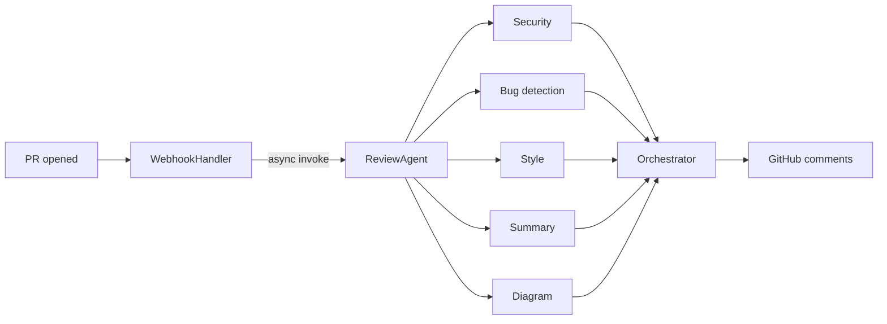

MergeWatch is an open-source GitHub App that reviews pull requests using a multi-agent AI pipeline. Self-host it anywhere with Docker and Postgres, or let MergeWatch run it for you as a managed SaaS. You choose the LLM. There is no per-seat pricing. The project is licensed under AGPL v3.

## How it compares

| | **MergeWatch** | **Greptile** | **CodeRabbit** |
|---|---|---|---|
| **Source** | Open source (AGPL v3) | Closed source | Closed source |
| **Hosting** | Self-hosted (Docker, any cloud) or SaaS | Self-hosted available (Docker, any cloud) | Self-hosted available (Enterprise, 500-seat min, $15K+/mo) |
| **Pricing** | No per-seat pricing — pay your LLM provider | Base platform fee + usage-based pricing | $24--$30/seat/month (annual vs monthly) |
| **Review approach** | Multi-agent parallel pipeline | Full-codebase graph + multi-hop analysis | AI review + 40+ linter integrations |
| **Model control** | You choose the LLM provider and model | Bring-your-own-LLM (self-hosted) | Vendor-controlled (SaaS); configurable on self-hosted |
| **Minimum commitment** | None | None stated | 500 seats for self-hosting |

## Key differentiators

<CardGroup cols={2}>
  <Card title="No per-seat pricing" icon="users">
    Install on your entire org. Costs scale with LLM usage, not headcount. A 200-person team pays the same platform cost as a 5-person team.
  </Card>
  <Card title="Your infrastructure, your data" icon="shield-halved">
    Self-host MergeWatch with Docker on any cloud or bare metal. Your code stays on your servers. You see every log. MergeWatch (the company) never sees your code.
  </Card>
  <Card title="AGPL v3 — genuinely open source" icon="code-branch">
    Read the source, audit it, fork it, contribute back. No open-core bait-and-switch. The AGPL v3 license means improvements must be shared, which keeps the project honest.
  </Card>
  <Card title="Multi-agent parallel review pipeline" icon="diagram-project">
    Five specialized agents — security, bugs, style, summary, and diagram — run in parallel. An orchestrator agent deduplicates overlapping findings and ranks them by severity before posting to GitHub.
  </Card>
</CardGroup>

## The review pipeline at a glance

<Note>
Each agent is a separate LLM invocation running in parallel via `Promise.all()`. The orchestrator runs after all agents complete.
</Note>

## Deployment models

| Model | Who runs it? | Data stays where? | Setup |
|---|---|---|---|
| **Self-Hosted** | You | Your infrastructure | `docker-compose up` |
| **Managed SaaS** | MergeWatch | MergeWatch AWS + your GitHub | GitHub App install |

## Infrastructure

### Self-Hosted Stack

MergeWatch self-hosted runs as a Docker container with a Postgres sidecar:

- **Express server** — receives GitHub webhooks, runs the review pipeline
- **PostgreSQL** — review state, repo config, installation data
- **Your LLM provider** — Anthropic (default), LiteLLM (100+ providers), Amazon Bedrock, or Ollama

No AWS account required (unless you choose Bedrock as your LLM provider).

### SaaS Stack

The managed SaaS runs on a serverless stack in MergeWatch's AWS account:

- **AWS Lambda** — WebhookHandler (512 MB / 30 s) and ReviewAgent (1024 MB / 300 s)
- **Amazon DynamoDB** — review state, repo config, user data
- **API Gateway** — GitHub webhook receiver
- **Amazon Bedrock** — Claude Sonnet (`us.anthropic.claude-sonnet-4-20250514-v1:0`)

Configuration lives in a `.mergewatch.yml` file at the root of each repository. The [dashboard](/dashboard/overview) provides a UI for monitoring reviews, managing repos, and adjusting settings.

<Accordion title="How is this different from CodeRabbit?">
  Both tools review PRs with AI. The differences are structural:

  **Where your code goes.** CodeRabbit's SaaS sends your code to their servers. Enterprise self-hosting exists but requires a 500-seat minimum at $15K+/month. MergeWatch self-hosts via a single `docker-compose up` with no seat minimum — code never leaves your infrastructure.

  **How you pay.** CodeRabbit charges $24--$30/seat/month depending on billing term. MergeWatch has no per-seat fee. You pay your own LLM provider directly, which scales with usage, not team size.

  **Source availability.** CodeRabbit is closed source. MergeWatch is AGPL v3 — you can read every line of the review logic, audit exactly what runs on your code, and contribute improvements.

  **Model choice.** On CodeRabbit SaaS, the vendor controls model selection. MergeWatch lets you choose any LLM provider — Anthropic, LiteLLM (100+ providers), Amazon Bedrock, or Ollama — and swap models at any time.
</Accordion>

---

<CardGroup cols={2}>
  <Card title="Quickstart" icon="rocket" href="/overview/quickstart">
    Install MergeWatch and get your first review in under 10 minutes.
  </Card>
  <Card title="How it works" icon="gears" href="/overview/how-it-works">
    Detailed walkthrough of the review pipeline, agent architecture, and orchestration.
  </Card>
</CardGroup>
