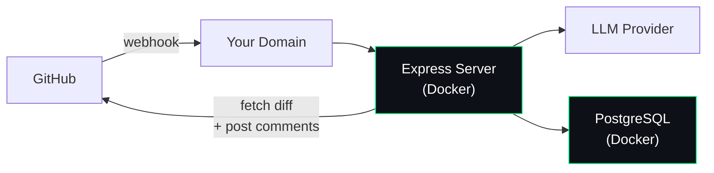

Self-hosting MergeWatch means running the application on your own infrastructure using Docker. Your code, diffs, and review results never leave your servers. MergeWatch (the company) has zero access to your data.

## What you get

- **Docker container + PostgreSQL** — runs on any cloud, any VM, or bare metal
- **No AWS required** — unless you choose Amazon Bedrock as your LLM provider
- **You control the LLM** — pick the provider that fits your needs
- **Always free** — no MergeWatch billing, you pay your LLM provider directly

## LLM providers

You choose which LLM powers your reviews by setting the `LLM_PROVIDER` environment variable:

| Provider | `LLM_PROVIDER` | Description |
|---|---|---|
| **Anthropic** (default) | `anthropic` | Direct Anthropic API. Requires `ANTHROPIC_API_KEY`. |
| **LiteLLM** | `litellm` | Proxy to 100+ LLM providers (OpenAI, Azure, Google, etc.). |
| **Amazon Bedrock** | `bedrock` | AWS Bedrock. Requires AWS credentials. |
| **Ollama** | `ollama` | Run models locally. Fully air-gapped. |

## Architecture

The Docker image (`ghcr.io/santthosh/mergewatch:latest`) runs an Express server that:

1. Receives GitHub webhooks on `/webhook` (port 3000)
2. Validates the HMAC-SHA256 signature
3. Fetches the PR diff from GitHub
4. Runs eight review agents in parallel against your chosen LLM
5. Posts review comments and a Check Run back to the PR
6. Stores the review record in PostgreSQL

PostgreSQL runs as a sidecar container managed by Docker Compose. Database migrations run automatically on container startup.

## Self-hosted vs Managed SaaS

| | Self-Hosted | Managed SaaS |
|---|---|---|
| **Who runs it** | You | MergeWatch |
| **Infrastructure** | Docker + Postgres | Lambda + DynamoDB + Bedrock |
| **Data isolation** | Complete — your servers only | Diff transits MergeWatch infra |
| **LLM choice** | Anthropic, LiteLLM, Bedrock, Ollama | Bedrock (Claude Sonnet) |
| **Cost** | Free + your LLM bill | First 20 PRs free, then usage-based |
| **Setup** | ~10 min | ~2 min |

## Next steps

<CardGroup cols={3}>
  <Card title="Prerequisites" icon="clipboard-check" href="/self-hosting/prerequisites">
    Docker and GitHub requirements before you start.
  </Card>
  <Card title="Install" icon="download" href="/self-hosting/install">
    Step-by-step install with Docker Compose.
  </Card>
  <Card title="LLM Providers" icon="brain" href="/self-hosting/llm-providers/anthropic">
    Configure Anthropic, LiteLLM, Bedrock, or Ollama.
  </Card>
</CardGroup>
